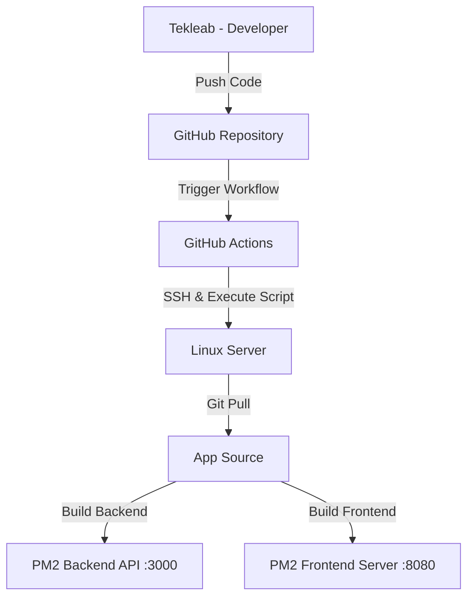

# 🚀 Todo App: CI/CD & Deployment Documentation

This document outlines the professional deployment architecture for the **Todo App**, featuring a React frontend and Node.js/Express backend. 

*Note: Due to `sudo` limitations during initial configuration, the Nginx domain setup was bypassed. The application is served directly via PM2 on designated ports per the system administrator's request.*

---

## 🏗 System Architecture

The application is deployed using a modern "Pull-Based" CI/CD strategy.



---

## 🛠 Prerequisites & Server Prep

### 1. System Dependencies
The following core technologies were installed on the server:
- **Node.js 18.x**: Runtime for backend and build tools.
- **PM2**: Production process manager for Node.js routing both frontend and backend.
- **Git**: For source control management.

### 2. Database Layer
The app requires a MySQL database. For quick setup, we can use a local MySQL instance or a Docker container:
```bash
docker run -d --name todo-mysql \
  -e MYSQL_ROOT_PASSWORD=yourpassword \
  -p 3306:3306 \
  mysql:8
```

---

## 🔗 CI/CD Pipeline Flow

The automation is handled via `.github/workflows/deploy.yml`. 

### Key Features:
- **Automated Deploy**: Every push to the `main` branch triggers an instant update.
- **Secure Credentials**: Sensitive info (IP, SSH Keys) is stored securely in **GitHub Secrets**.
- **Self-Healing Script**: The `deploy.sh` script automatically fetches code, installs dependencies, builds static files, and restarts all PM2 processes.

### Required Secrets:
| Secret Name | Description |
| :--- | :--- |
| `SERVER_HOST` | Remote server IP address (e.g., 196.188.187.153) |
| `SERVER_USER` | SSH Username (e.g., dev) |
| `SERVER_SSH_KEY` | Private key for passwordless login |

---

## 🌐 Port Configuration

Because `sudo` privileges were unavailable to fully configure Nginx, the application relies on PM2 to map processes directly to ports:
- **Frontend App**: `http://<SERVER_IP>:8080` (Started via `pm2 serve dist 8080 --spa`)
- **Backend API**: `http://<SERVER_IP>:3000` (Started via `pm2 start dist/index.js`)

The frontend dynamically queries the backend API by grabbing its current hostname and targeting port `3000`.

---

## 🩺 Troubleshooting & Maintenance

- **View Logs**: `pm2 logs` (shows logs for both frontend and backend)
- **Check Status**: `pm2 status`
- **Restart Services**: `pm2 restart all`
- **Environment Variables**: Ensure `.env` is configured correctly in `/home/dev/project/todo-app/backend/`.

---

**Developed & Deployed by Tekleab.**
