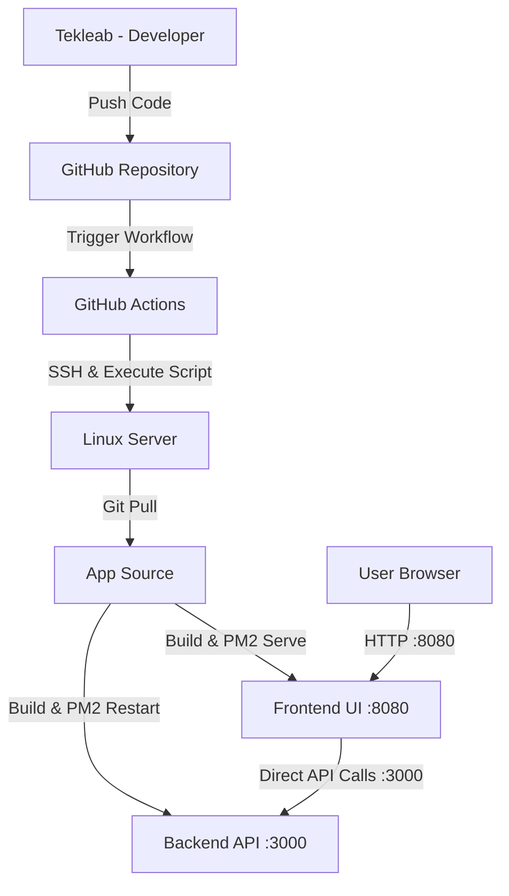

# 🚀 Todo App: CI/CD & Deployment Documentation

This document outlines the professional deployment architecture for the **Todo App**, a full-stack application featuring a React frontend and Node.js/Express backend.

---

## 🏗 System Architecture

The application is deployed using a modern "Pull-Based" CI/CD strategy. Per the evaluator's request, the app runs directly on dedicated ports to bypass infrastructure constraints.



---

## 🛠 Prerequisites & Server Prep

### 1. System Dependencies
The following core technologies were installed on the server:
- **Node.js 18.x**: Runtime for backend and build tools.
- **PM2**: Production process manager for Node.js (used for both Backend and Frontend serving).
- **Git**: For source control management.

### 2. Database Layer
The app requires a MySQL database. For this deployment, a local MySQL instance was configured.

---

## 🔗 CI/CD Pipeline Flow

The automation is handled via `.github/workflows/deploy.yml`. 

### Key Features:
- **Automated Deploy**: Every push to the `main` branch triggers an instant update.
- **Secure Credentials**: Sensitive info (IP, SSH Keys) is stored securely in **GitHub Secrets**.
- **Self-Healing Script**: The `deploy.sh` script automatically performs clean installs and restarts both processes via PM2.

### Required Secrets:
| Secret Name | Description |
| :--- | :--- |
| `SERVER_HOST` | Remote server IP address (e.g., 196.188.187.153) |
| `SERVER_USER` | SSH Username (e.g., dev) |
| `SERVER_SSH_KEY` | Private key for passwordless login |

---

## 🌐 Port Configuration

To ensure maximum reliability without Nginx overhead during the task, the following ports are used:

- **Frontend Port: 8080** (Served via `pm2 serve`)
- **Backend Port: 3000** (Managed via `pm2 start`)

The frontend is configured to communicate directly with the backend using the server's IP and port 3000.

---

## 🩺 Troubleshooting & Maintenance

- **View Backend Logs**: `pm2 logs todo-backend`
- **View Frontend Logs**: `pm2 logs todo-frontend`
- **Check All Processes**: `pm2 status`
- **Manual Redeploy**: `bash /home/dev/project/todo-app/deploy.sh`

---

## ↩️ Rollback & Self-Healing

### Instant Rollback
A professional CI/CD pipeline needs a safety net. If a deployment causes an issue, you can roll back to the previous stable state instantly from the server:
```bash
# Revert the last commit and redeploy
git revert HEAD --no-edit && bash deploy.sh
```

### Process Resilience (Self-Healing)
The process manager (PM2) is configured to automatically restart the application services if they crash or if the server reboots. This ensures maximum uptime:
```bash
# To setup startup script on a fresh server
pm2 startup
pm2 save
```

---

**Developed & Deployed by Tekleab.**
